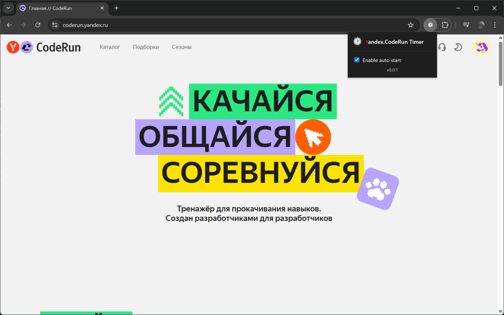
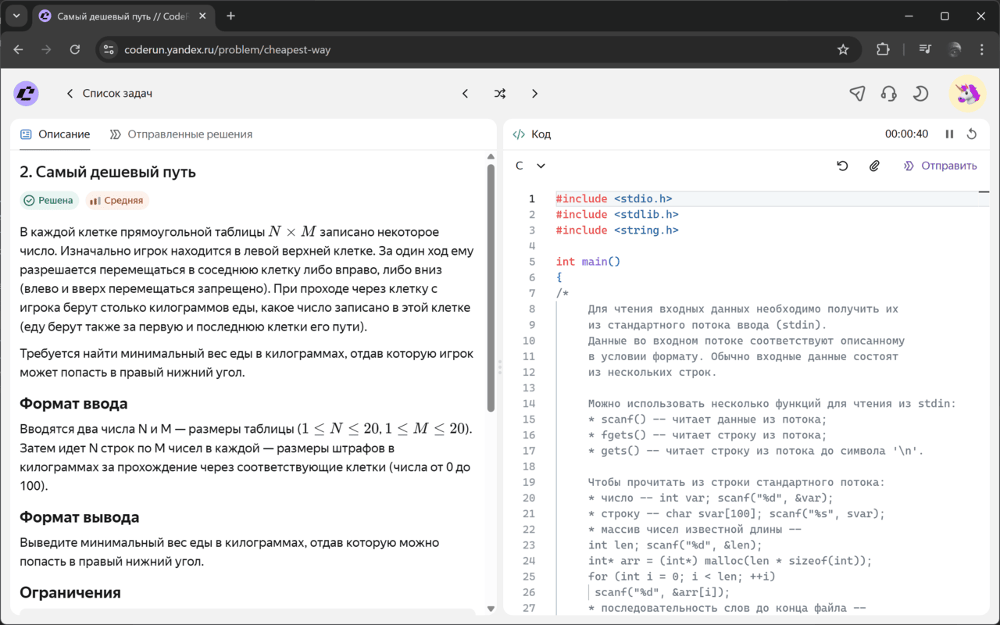
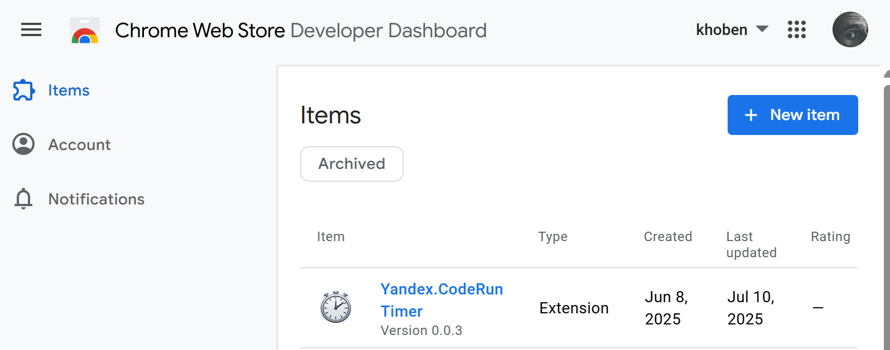

## Why it was needed
It's strange that Yandex itself didn't think of making a timer for its CodeRun project. For example, LeetCode has a very convenient timer that helps in preparing for algorithmic sections. So, we'll make a simple timer ourselves that can be integrated into the CodeRun interface and help track the time spent on solving problems.

---

## What the extension does
So far, the extension is quite simple, with start/pause/reset time functions. However, various cases are provided for:  
- Time is counted even if the tab is closed while the timer is active
- Synchronization of the timer status with multiple tabs
- Customizable auto-start of the timer when opening a page with a task

</> **Source code**:
https://github.com/khoben/yandex-coderun-timer

📥 **Download Yandex CodeRun Timer from the Chrome Web Store:**  
https://chromewebstore.google.com/detail/yandexcoderun-timer/gdceapilfngabjiphgpilfnnhmpfoaci





---

## How it works

The extension works quite simply:
- We track pages with URLs that may contain tasks to be solved: these are addresses that match the regular expression `/^https:\/\/coderun\.yandex\.ru\/.*problems?\/.+$/;`

- We embed code with a timer in the right place on the page

Manifest V3 has introduced restrictions: **background processes no longer run indefinitely**, which is critical for the timer.

We had to use the approach described by Google itself [in its documentation](https://developer.chrome.com/docs/extensions/develop/migrate/to-service-workers#keep_a_service_worker_alive_continuously):

```js
// Keep a service worker alive continuously - keep background timer alive
// https://developer.chrome.com/docs/extensions/develop/migrate/to-service-workers#keep_a_service_worker_alive_continuously
let heartbeatInterval = null;
function runHeartbeat() {
    chrome.storage.local.set({ "last-heartbeat": Date.now() });
}
function startHeartbeat() {
    if (heartbeatInterval) clearInterval(heartbeatInterval);
    runHeartbeat();
    heartbeatInterval = setInterval(runHeartbeat, 20 * 1000);
}
startHeartbeat();
```

The background service worker (`background.js`) acts as the presenter layer (*Presenter*), while the injected code with the timer (`content.js`) acts as the view layer (*View*). The timer state is stored in [chrome.storage.local](https://developer.chrome.com/docs/extensions/reference/api/storage).


### Detecting a tab with a task

We listen to which tabs are opened via [chrome.webNavigation.onHistoryStateUpdated](https://developer.chrome.com/docs/extensions/reference/api/webNavigation). If the tab we need is opened, we embed the code with the timer.

```js
chrome.webNavigation.onHistoryStateUpdated.addListener(async (details) => {
    if (details.frameId !== 0 || !problemPathRegex.test(details.url)) return;

    const { tabId } = details;
    state.activeTabs.add(tabId); // Add the tab to the state broadcast list

    await injectContentScripts(tabId);

    if (state.autoStart && !state.timerState.isRunning && state.timerState.seconds === 0) {
        startTimer();
    }
});
```

### Embedding code with a timer

We embed .js code using [chrome.scripting.executeScript](https://developer.chrome.com/docs/extensions/reference/api/scripting) and .css files using [chrome.scripting.insertCSS](https://developer.chrome.com/docs/extensions/reference/api/scripting) in the tab.

```js
const injectContentScripts = async (tabId) => {
    try {
        await Promise.all([
            chrome.scripting.insertCSS({
                target: { tabId },
                files: ["styles.css"]
            }),
            chrome.scripting.executeScript({
                target: { tabId },
                files: ["content.js"]
            })
        ])
        console.log("Scripts injected successfully");
    } catch (err) {
        console.error("Injection failed:", err);
    }
};
```

### Timer control and time calculation by service worker

For each timer tick (1000 ms), we change the timer state and broadcast the new state to the tabs. At the same time, we save the timer state in local storage. The logic is similar for control functions (start, pause, reset).

```js
let timerInterval = null;
function startTimer() {
    if (timerInterval) clearInterval(timerInterval);
    state.timerState.isRunning = true;
    if (state.timerState.lastUpdate) {
        const now = Date.now();
        const timeElapsed = Math.floor((now - state.timerState.lastUpdate) / 1000);
        state.timerState.seconds += timeElapsed;
        state.timerState.lastUpdate = now;
    }
    timerInterval = setInterval(() => {
        state.timerState.lastUpdate = Date.now();
        state.timerState.seconds++;
        chrome.storage.local.set({ timerState: state.timerState });
        broadcastState();
    }, 1000);
}

function pauseTimer() {
    clearInterval(timerInterval);
    state.timerState.isRunning = false;
    state.timerState.lastUpdate = null;
    chrome.storage.local.set({ timerState: state.timerState });
    broadcastState();
}

function resetTimer() {
    clearInterval(timerInterval);
    state.timerState = {
        seconds: 0,
        isRunning: false,
        lastUpdate: null
    };
    chrome.storage.local.set({ timerState: state.timerState });
    broadcastState();
}
```

### Communication between tabs and service worker

> Service worker → Tab

Broadcasting state by service worker across tabs:
```js
const broadcastState = () => {
    for (const tabId of state.activeTabs) {
        chrome.tabs.sendMessage(tabId, {
            action: "updateState",
            state: state.timerState
        }).catch(console.error);
    }
}
```

Receiving status from the service worker on the tab:
```js
chrome.runtime.onMessage.addListener((request, sender, sendResponse) => {
    if (request.action === "updateState") {
        updateViewState(request.state);
    }
    sendResponse();
});

function updateViewState(state) {
    updateTimerDisplay(state.seconds);
    toggleTimerButton(state.isRunning);
}
```

Removing an inactive tab:
```js
chrome.tabs.onRemoved.addListener((tabId) => {
    state.activeTabs.delete(tabId);
});
```

> Tab → Service worker

Sending an event from a tab (pressing start/pause/reset):
```js
function emitEvent(type, callback = null) {
    if (!chrome.runtime?.id) return;
    chrome.runtime.sendMessage({ action: type }, callback);
}
```
Receiving an event from a service worker from a tab:
```js
chrome.runtime.onMessage.addListener((request, sender, sendResponse) => {
    const fromTabId = sender.tab?.id;
    if (!fromTabId) {
        sendResponse();
        return;
    }

    switch (request.action) {
        case "startEvent":
            if (state.timerState.isRunning) return;
            startTimer();
            break;

        case "pauseEvent":
            if (!state.timerState.isRunning) return;
            pauseTimer();
            break;

        case "resetEvent":
    resetTimer();
    break;

    case "getState":
        sendResponse({ state: state.timerState });
        return;
    }

    sendResponse();
});
```

### Manifest overview

*manifest.json:*
```json
{
    "manifest_version": 3,
    ...
    "background": {
        "service_worker": "background.js"
    },
    "host_permissions": [
        "https://coderun.yandex.ru/*"
    ],
    ...
    "permissions": [
        "webNavigation",
        "scripting",
        "storage"
    ]
}
```

| Permission    | Purpose      |
|----------------|---------------|
| webNavigation  | Tracking the URL with a task   |
| scripting      | Injecting a timer in the page source code  |
| storage        | Storing the timer state |

---

## Publishing in the Chrome Web Store
It turns out that I had already registered in the Chrome Web Store, so I don't remember all the details. Except that you have to pay $5 to access the Chrome Web Store Console.

After that, you can publish extensions for Chrome.



The process of listing the extension itself should not be difficult:

- Click *New Item* and upload the **.zip** archive with the extension source code
- Fill in the required fields: explain why certain permissions are needed, take screenshots, write a description, etc.

After moderation, the extension becomes available in the Chrome Web Store

---

## Summary
I always wanted to try making an extension for Chrome, especially since I had a reason to do so. Now, with Yandex Coderun Timer, you can track how much time you actually spend on a task: the timer is always visible in the interface, so you don't need to use third-party applications and manually time yourself.

</> **Source code**:
https://github.com/khoben/yandex-coderun-timer

📥 **Download Yandex CodeRun Timer from the Chrome Web Store:**  
https://chromewebstore.google.com/detail/yandexcoderun-timer/gdceapilfngabjiphgpilfnnhmpfoaci