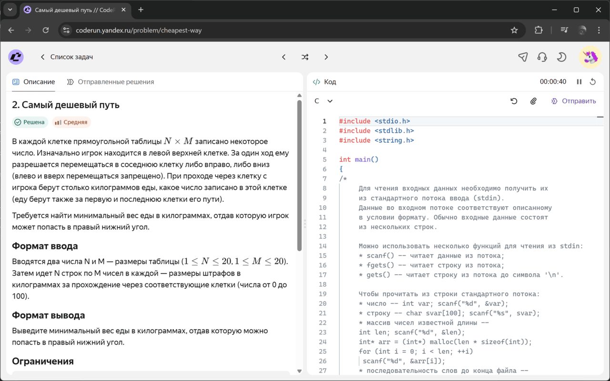
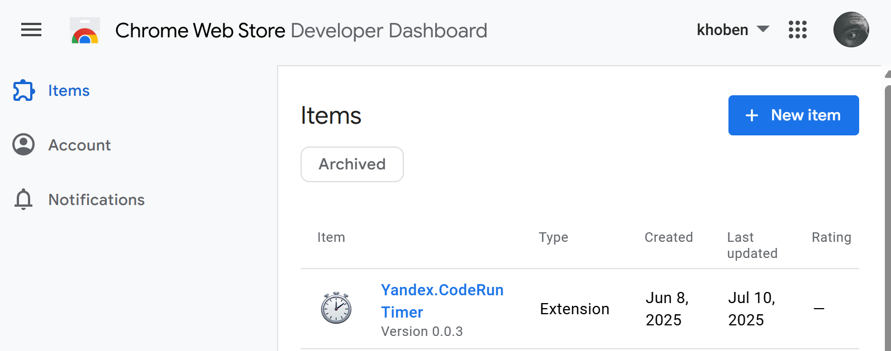

## Зачем понадобилось
Странно, что сам Yandex не додумался сделать таймер для своего проект CodeRun. Например, в LeetCode таймер очень удобно реализован и помогает в подготовке к алгоритмическим секциям. Что ж самостоятельно сделаем простой таймер, который бы встраивался в интерфейс CodeRun и помогал трекать потраченное на решение время.

---

## Что делает расширение
Пока что расширение довольно простое, с функцией старта/паузы/сброса времени. Тем не менее, предусмотрены различные кейсы:  
- Время считается даже если вкладка закрыта при активном таймере
- Синхронизация состояния таймера с несколькими вкладками
- Настраиваемый авто-старт таймера при открытии страницы с задачей

📥 **Скачать Yandex CodeRun Timer в Chrome Web Store:**  
https://chromewebstore.google.com/detail/yandexcoderun-timer/gdceapilfngabjiphgpilfnnhmpfoaci




---

## Как это устроено внутри

Схема работы расширения довольна проста:
- Отслеживаем страницы с URL'ами, где могут быть задания для решения: это адреса, удовлетворяющие регулярному выражению:
  ```regex
  /^https:\/\/coderun\.yandex\.ru\/.*problems?\/.+$/;
  ```
- В нужное место страницы встраиваем код с таймером

Manifest V3 внёс ограничения: **фоновые процессы больше не живут бесконечно**, а для таймера это критично.

Пришлось воспользоваться подходом, который описал сам же [Google в своей документации](https://developer.chrome.com/docs/extensions/develop/migrate/to-service-workers#keep_a_service_worker_alive_continuously):
```js
// Keep a service worker alive continuously - keep background timer alive
// https://developer.chrome.com/docs/extensions/develop/migrate/to-service-workers#keep_a_service_worker_alive_continuously
let heartbeatInterval = null;
function runHeartbeat() {
    chrome.storage.local.set({ 'last-heartbeat': Date.now() });
}
function startHeartbeat() {
    if (heartbeatInterval) clearInterval(heartbeatInterval);
    runHeartbeat();
    heartbeatInterval = setInterval(runHeartbeat, 20 * 1000);
}
startHeartbeat();
```

Фоновый сервисный воркер (`background.js`) выступает в роли слоя презентации (*Presenter*), тогда как инжектируемый код с таймером (`content.js`) в роли слоя представления (*View*). Состояние таймера хранится в [chrome.storage.local](https://developer.chrome.com/docs/extensions/reference/api/storage).


### Обнаружение вкладки с задачей

Через [chrome.webNavigation.onHistoryStateUpdated](https://developer.chrome.com/docs/extensions/reference/api/webNavigation) слушаем какие вкладки открываются. Если открывается нужная нам, встраиваем код с таймером.

```js
chrome.webNavigation.onHistoryStateUpdated.addListener(async (details) => {
    if (details.frameId !== 0 || !problemPathRegex.test(details.url)) return;

    const { tabId } = details;
    state.activeTabs.add(tabId); // Добавление вкладки в список рассылки состояния

    await injectContentScripts(tabId);

    if (state.autoStart && !state.timerState.isRunning && state.timerState.seconds === 0) {
        startTimer();
    }
});
```

### Встраивание кода с таймером

Через [chrome.scripting.executeScript](https://developer.chrome.com/docs/extensions/reference/api/scripting) встраиваем .js код, а через [chrome.scripting.insertCSS](https://developer.chrome.com/docs/extensions/reference/api/scripting) .css файлы во вкладку.

```js
const injectContentScripts = async (tabId) => {
    try {
        await Promise.all([
            chrome.scripting.insertCSS({
                target: { tabId },
                files: ["styles.css"]
            }),
            chrome.scripting.executeScript({
                target: { tabId },
                files: ["content.js"]
            })
        ])
        console.log("Scripts injected successfully");
    } catch (err) {
        console.error('Injection failed:', err);
    }
};
```

### Управление таймером и подсчет времени сервис-воркером

На каждый тик таймера (1000 мсек) изменяем состояние таймера и делаем броадкаст по вкладкам с новый состоянием. За одно сохраняем состояние таймера в локальном хранилище. Для функций управления (старт, пауза, сброс) логика аналогична.
```js
let timerInterval = null;
function startTimer() {
    if (timerInterval) clearInterval(timerInterval);
    state.timerState.isRunning = true;
    if (state.timerState.lastUpdate) {
        const now = Date.now();
        const timeElapsed = Math.floor((now - state.timerState.lastUpdate) / 1000);
        state.timerState.seconds += timeElapsed;
        state.timerState.lastUpdate = now;
    }
    timerInterval = setInterval(() => {
        state.timerState.lastUpdate = Date.now();
        state.timerState.seconds++;
        chrome.storage.local.set({ timerState: state.timerState });
        broadcastState();
    }, 1000);
}

function pauseTimer() {
    clearInterval(timerInterval);
    state.timerState.isRunning = false;
    state.timerState.lastUpdate = null;
    chrome.storage.local.set({ timerState: state.timerState });
    broadcastState();
}

function resetTimer() {
    clearInterval(timerInterval);
    state.timerState = {
        seconds: 0,
        isRunning: false,
        lastUpdate: null
    };
    chrome.storage.local.set({ timerState: state.timerState });
    broadcastState();
}
```

### Общение между вкладками и сервис-воркером

> Сервисный воркер → Вкладка

Рассылка состояния сервис-воркером по вкладкам:
```js
const broadcastState = () => {
    for (const tabId of state.activeTabs) {
        chrome.tabs.sendMessage(tabId, {
            action: "updateState",
            state: state.timerState
        }).catch(console.error);
    }
}
```

Приём состояния от сервис-воркера на вкладке:
```js
chrome.runtime.onMessage.addListener((request, sender, sendResponse) => {
    if (request.action === "updateState") {
        updateViewState(request.state);
    }
    sendResponse();
});

function updateViewState(state) {
    updateTimerDisplay(state.seconds);
    toggleTimerButton(state.isRunning);
}
```

Удаление неактивной вкладки:
```js
chrome.tabs.onRemoved.addListener((tabId) => {
    state.activeTabs.delete(tabId);
});
```

> Вкладка → Сервисный воркер

Отправка события с вкладки (нажатие старт/пауза/сброс):
```js
function emitEvent(type, callback = null) {
    if (!chrome.runtime?.id) return;
    chrome.runtime.sendMessage({ action: type }, callback);
}
```
Приём события сервис-воркером с вкладки:
```js
chrome.runtime.onMessage.addListener((request, sender, sendResponse) => {
    const fromTabId = sender.tab?.id;
    if (!fromTabId) {
        sendResponse();
        return;
    }

    switch (request.action) {
        case "startEvent":
            if (state.timerState.isRunning) return;
            startTimer();
            break;

        case "pauseEvent":
            if (!state.timerState.isRunning) return;
            pauseTimer();
            break;

        case "resetEvent":
            resetTimer();
            break;

        case "getState":
            sendResponse({ state: state.timerState });
            return;
    }

    sendResponse();
});
```

### Обзор Manifest

*manifest.json:*
```json
{
    "manifest_version": 3,
    ...
    "background": {
        "service_worker": "background.js"
    },
    "host_permissions": [
        "https://coderun.yandex.ru/*"
    ],
    ...
    "permissions": [
        "webNavigation",
        "scripting",
        "storage"
    ]
}
```

| Разрешение    | Для чего      |
|----------------|---------------|
| webNavigation  | Ослеживание адреса с задачей   |
| scripting      | Встраивание таймера в исходный код страницы  |
| storage        | Хранение состояния таймера |

---

## Публикация в Chrome Web Store
Оказывается, что уже ранее регистрировался в Chrome Web Store, поэтому всех тонкостей не помню. Разве, что для доступа к Chrome Web Store Console необходимо оплатить $5.

После появляется возможность выкладки расширений для Chrome.



Сам процесс листинга расширения не должен составить труда:

- Жмём *New Item* и загружаем **.zip** архив с исходниками расширения
- Заполняем необходимые поля: поясняем зачем нужны те или иные разрешения, делаем скриншоты, описание и т.д.

После модерации, расширение становится доступно в Chrome Web Store

---

## Итог
Всегда хотел попробовать сделать расширение для Chrome, тем более подвернулся такой повод. Теперь с помошью Yandex Coderun Timer можно отслеживать сколько времени реально уходит на задачу: таймер всегда на виду в интерфейсе, не нужно пользоваться сторонними приложениями и вручную засекать время.

📥 **Скачать Yandex CodeRun Timer в Chrome Web Store:**  
https://chromewebstore.google.com/detail/yandexcoderun-timer/gdceapilfngabjiphgpilfnnhmpfoaci