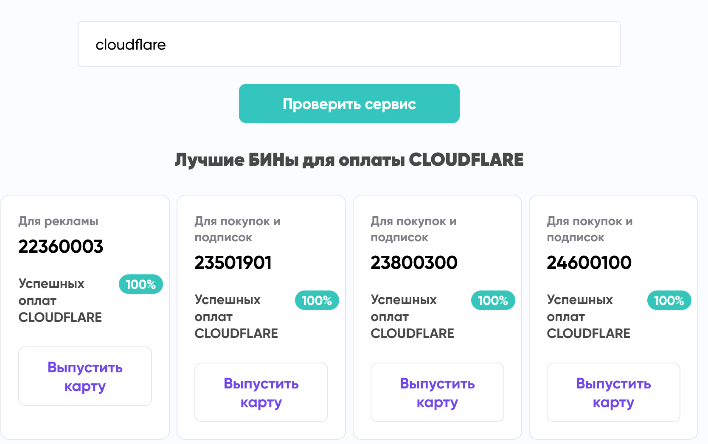
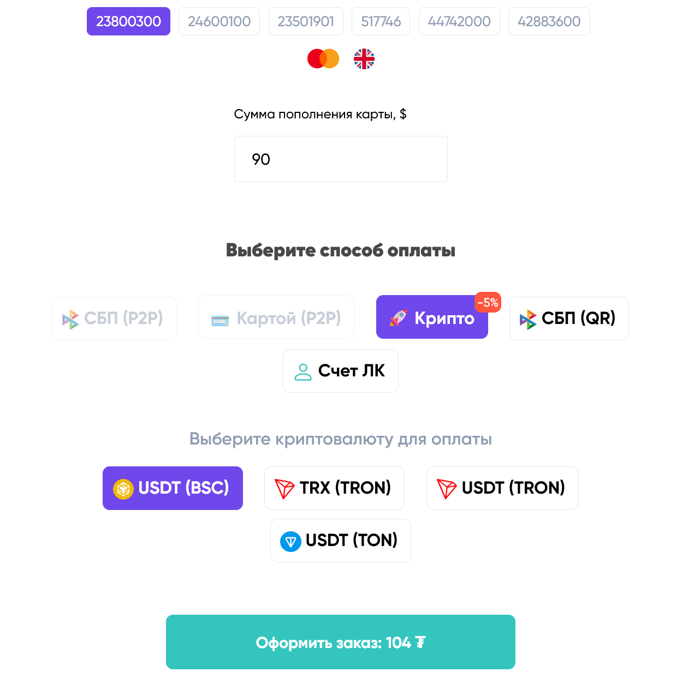
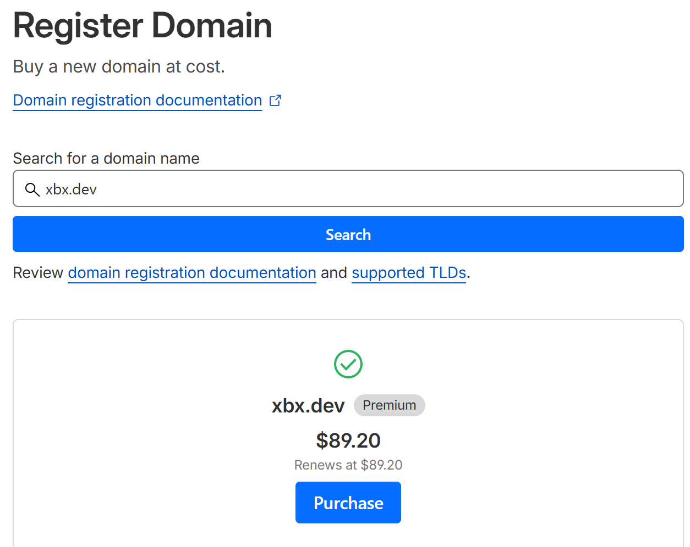
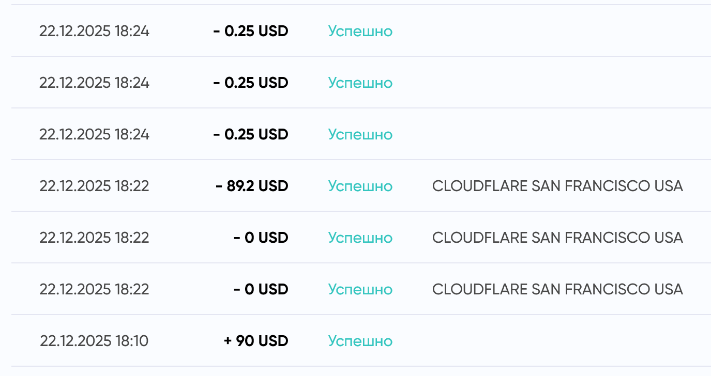
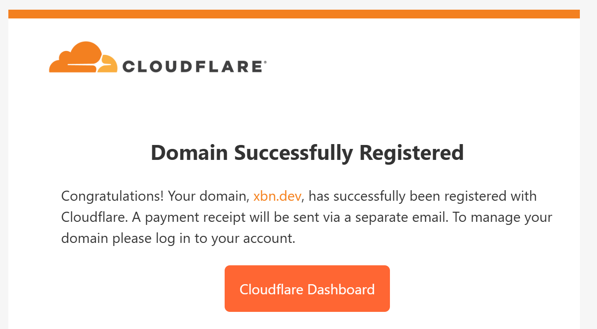

## Сравнение цен на домены

Внезапно захотелось приобрести трёхбуквенный домен в зоне .dev. Цены на год для .dev (premium) у разных регистраторов следующие:

| Регистратор     | Цена          |
|----------------|---------------|
| Cloudflare     | $89.2 / год   |
| Namecheap      | $115.7 / год  |
| Godaddy        | $139.99 / год |
| Timeweb.cloud  | 13 100₽ / год |
| NIC.ru         | 23 645₽ / год |
| REG.ru         | 25 223₽ / год |

Выбор очевиден в пользу Cloudflare. Помимо прочего, Cloudflare предлагает бесплатную защиту WHOIS, бесплатный SSL/TLS (конечно, без проблем ставится Let's Encrypt, но все же) и удобную пвнель управления.
Забегая вперёд — разница между оплатой в Timeweb.cloud и Cloudflare оказалась около **4700₽**.

## Сервис виртуальных карт для оплаты

Просмотрел предложения разных сервисов, потыкал несколько вариантов — WantToPay, AlfaBit, PyyplBot. После непродолжительного сравнения выбрал [ПиплБот (PyyplBot)](https://pyyplbot.com/?refid=293201205) из-за сравнительно небольших комиссий и простоты открытия карты.  
Комиссия за открытие карты — 875₽ или 10.4 USDT (на момент написания статьи).

Возможно, есть и другие сервисы с сопоставимыми комиссиями и удобством.

## Оплата

### Создание виртуальной карты

Сначала посмотрел подходящие типы карт для оплаты именно Cloudflare:

Для Cloudflare выбрал карту **«Для покупок и подписок»** с BIN 23800300 (первые цифры карты, определяющие банк).

Оплатить можно через QR-платёж или криптовалютой. Обработка прошла быстро — примерно через 5 минут карта была готова к использованию.

### Оплата и регистрация домена в Cloudflare

> Dashboard → Domains → Buy Domain

Дальше всё стандартно: вводим реквизиты карты, биллинг-адрес, имя и другие данные для регистрации домена.

**Нюанс:** за каждую транзакцию и привязку карты взимается небольшая комиссия 0.25 USD, поэтому баланс чуть ушёл в минус — его можно пополнить позже.

Домен успешно оплачен и зарегистрирован 🎉  

Если карта больше не нужна, её можно закрыть, чтобы не взималась ежемесячная комиссия за обслуживание. Перед этим стоит удалить её из способов оплаты Cloudflare:

> Dashboard → Billing → Payment

## Итог

С помощью сервиса виртуальных карт оплаты [ПиплБот (PyyplBot)](https://pyyplbot.com/?refid=293201205) мне удалось зарегистрировать домен по неплохой цене в Cloudflare. Скорее всего, карта подойдет для оплаты и других сервисов.